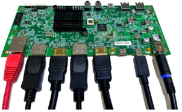

.. _dl_7450_introduction:

Introducing the DL-7450
=======================

Synaptics is expanding its architecture by offering reference platform designs
through a Software Development Kit (SDK), allowing partners to customize
software features and applications using a growing Application Programming
Interface (API). The API classes and methods will grant access to various
components of the DL-7450 silicon, enabling customer code to run on
dedicated processors via a Python virtual machine.  Over time, additional APIs
will become available, providing broader access to different parts of the
platform, and offering more customized control for designing future products.

The Synaptics SDK will equip developers with a comprehensive set of tools,
libraries, and documentation to create applications for specific platforms or
software frameworks. It offers the essential resources and guidelines needed to
build applications efficiently and effectively, streamlining the development
process with pre-built components and sample code that can be easily
integrated. This approach allows developers to focus on the core logic of their
applications without having to reinvent common features.

Included in the SDK are debugging tools and testing frameworks to help
developers identify and resolve issues swiftly. By providing access to
third-party services and APIs, the SDK helps developers enhance the
functionality of their software without the need to build and maintain these
features independently. This essential tool simplifies the development process,
ensuring compatibility and consistency, while offering access to valuable
third-party services.

Using the SDK, developers can save time, reduce errors, and create high-quality
applications that meet platform or framework standards and requirements. This
efficiency enables them to address customer needs more effectively and
differentiate their platforms in the market.

**Included in the box**

 a. Reference DL-7450 board and corresponding daughter cards

 b. AC power adapter (USB Power Delivery)

 c. USB-C cable (USB-C plugs on both ends)

 d. AC plug adapter (IET Type A receptacle / Type C plug, used only if applicable)

**Additional items needed**

 e. Display monitors with HDMI / DP ports

 f. Up to 4 monitors can be supported from a single reference board

 g. A HDMI cable (standard HDMI Type A plugs on both ends)

 h. Ethernet Cat 5/6/6e RJ.45 connected cable

Note: Ethernet or network connection is not needed for the initial boot.

**Initial connections**

The below graphic shows a typical connection to a host device with 2
x 4K DisplayPort monitors, 2 x 4K HDMI monitors and Gigabit Ethernet interface.
Power for the reference design is provided by an external AC/DC power supply.

Our DisplayLink technology makes it simple to connect any display to any
computer that supports USB or Wi-Fi and provides universal solutions for a
range of corporate, home and embedded applications where easy connectivity of
displays enhances productivity. With DisplayLink, expanding your visual
workspace has never been easier or more affordable. Our technology makes it
really easy to connect any display to any computer. We call this Plug and
Display. To get the latest version of host software please visit
`our download area <https://www.synaptics.com/products/displaylink-graphics>`_.

**Setting up the hardware**

The assembled reference design, *DL-7450-Redwood Quad Video IoT dock*, or just
*Redwood* includes a 2.5GbE PHY daughter board (plugged into J6) and a
Joystick. 

The  reference design is provided as a functional demonstrator of the DL-7450
SoC implemented in an IoT quad video (2 x DisplayPort and 2 x HDMI) dock
design. The design is intended to be refined at a future date by ODM partners.
The evaluation-ready kit enables easy and rapid prototyping for the Synaptics
DL-7450 processor. This page lists the simple steps to power on and boot up the
system.

The following graphic shows the board connectors, switches and jumpers.

.. image:: ../images/redwood_connectors.png

.. image:: ../images/board_connectivity.png

**Board Connectivity**

The reference design supports the following connections:

Display Ports – J12, J14

The reference design supports two DisplayPort interfaces DP1 and DP3. Both
ports are connected the same.

 * J12 – DL-7450 DisplayPort 1
 * J14 – DL-7450 DisplayPort 3 (Provides *Display Stream Compression* (DSC) Support)

HDMI Ports – J11, J13

The reference design supports two HDMI Port interfaces using DP0 and DP2 up to
HDMI2.0 Mode.  Both ports are connected the same.

 * J11 – DL-7450 HDMI 1 using DisplayPort 0 (In HDMI Mode)
 * J13 – DL-7450 HDMI 2 using DisplayPort 2 (In HDMI Mode)

USB Ports – J15, J16, J19, J20, J21

The *Redwood* incorporates a USB3.2 Gen2 hub with USB power delivery (PD) support.

 * J15 – USB 3.2 Gen 1 USB-A Downstream facing port
 * J16 – USB 3.2 Gen 1 USB-A Downstream facing port
 * J19 – USB 3.2 Gen 2 USB-C Downstream facing port
 * J20 – USB 3.2 Gen 2 USB-C Upstream facing port
 * J21 – USB 3.2 Gen 2 USB-C Upstream facing port with USB power delivery (PD) support.

As J20 and J21 are both upstream facing ports only one port shall be connected
to a host at any one time.  LED7 (J21) and LED8 (J20) indicate which port is
active.

DC Power Input – J9

The J9 DC power input is used to provide power to the *Redwood*, the
interface connector is a 7.5mm/5mm DC jack.

**Power Interface Control Port – J10**

The J10 port is designed to support an external daughter board providing PSID
support. This feature is currently unsupported by the reference design.

**3.5mm Audio Jack – J4**

The DL-7450- Redwood quad video IOT Dock reference design incorporates a 3.5mm
audio jack integrated with an I2S audio CODEC supporting a stereo headset with
microphone.

**3.5mm Microphone Audio Jack – J23**

The DL-7450- Redwood quad video IOT Dock reference design also incorporates a
selectable 3.5mm audio jack integrated with an I2S audio CODEC supporting a
stereo microphone only. (Not currently supported by firmware)

**Fingerprint Module Connector – J7**

The DL-7450- Redwood quad video IOT Dock reference design has been designed to
support an optional Synaptics FS76xx fingerprint sensor module. This feature is
currently unsupported by the reference design.

**RJ-45 10/100/1000 Ethernet – J5**

A MotorComm YT8531C PHY has been provided to support 10/100/1000 Ethernet
speeds via a RJ-45 connector. LEDs in the RJ-45 connector provide link and
activity information. Link LED - Yellow LED to indicate that there is an active
connection on the Ethernet port.  Speed/Activity LED

The speed/activity LED blink when there is Ethernet activity, the link speed is
indicated as follows:

 * 10Mb Link Amber
 * 100Mb Link Amber
 * 1000Mb Link Green

**2.5Gb Ethernet Interface – J6**

When IOT functionality is required then the 2.5Gb Ethernet adapter must be
used. The *Redwood* reference design provides support for a daughter board
used to support a 2.5G Ethernet. PHY (The Maxlinear GPY211). The daughter board
is interfaced via a mezzanine connector J6. Contact.

**Debug Connector – J1**

Debug connector J1 provides I2C and UART0 TX signals for debugging activities.

   +-------+---------------+----------------------------------------------------+
   | PIN   | Connectivity  | Notes                                              |
   +=======+===============+====================================================+
   | 1     | DL_SCL0       | DL-7450 I2C Clock, 10K pullup to +5V0 Power Plane  |
   +-------+---------------+----------------------------------------------------+
   | 2     | DL_SDA0       | DL-7450 I2C Data, 10K pullup to +5V0 Power Plane   |
   +-------+---------------+----------------------------------------------------+
   | 3     | 5V_SYS        | Direct connection to +5V0 Power Plane              | 
   +-------+---------------+----------------------------------------------------+
   | 4     | DLUART_TXD    | DL-7450 UART0 TXD -3V3 signal                      |
   +-------+---------------+----------------------------------------------------+
   | 5     | GND           | Direct Connection to GND plane                     |
   +-------+---------------+----------------------------------------------------+

