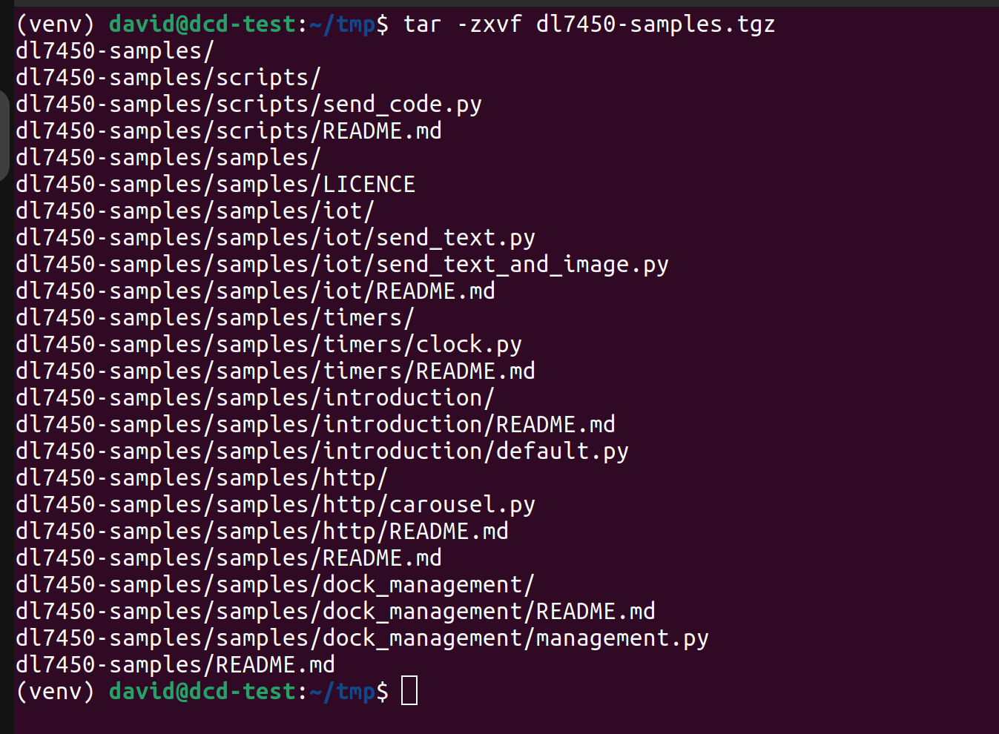

.. _dl_7450_quickstart:

Getting started
===============

You should have received a *DL-7450-Redwood-REFD Quad Video IoT dock*. You can
obtain the data sheet for the board from the `DisplayLink Customer Portal
<https://cp.synaptics.com/cognidox/view/NR-155509-DS>`_ or see
:doc:`introduction`. The following image shows the Redwood board.

.. image:: ../images/redwood.png

To get started, connect a monitor to at least one of the DisplayPort or HDMI
outputs, and power the dock up using the power supply that is provided in the
box. You will also need to connect the board to your network, using the 2.5GbE
PHY daughter board.

When the DL-7450 boots you will see a screen like the one below, and if it has
connected to the network it should have an IP address. The dock name that is
shown on the screen should match the sticker on the DL-7450 board. 

.. image:: ../images/start_screen.png

You should have received an archive file called *dl7450-samples.tgz*. Expand this archive:

The resulting files consist of some sample applications and README documents
that show how to create some simple applications that will run on the DL-7450.

To send code to the dock we have provided a ``send_code.py`` python script, located
in the *scripts* directory, to run this you will need some flavour of python 3
installed, and the ``requests`` package installed. The script has been tested against versions 3.8 and 3.12.

For example, when running from the root folder of that archive::

    python ./scripts/send_code.py \
      --key 241FB8AF5E23E00406E985E6-My-Application \
      --secret 3334e363-efd2-a764-e789-d7daf71245f9  \
      --enterprise 4d0ec8a128f9a6814acf8a96 \
      --dock A7BBAFE26E7E94EE650DD9AC039EBC4569265A8EAD08A7F8BA1AAFFFF21523B \
      --file ./samples/http/carousel.py

.. warning::
   In Windows there is a length limit on the filesystem. If you hit any ``FileNotFoundError: [Errno 2] No such file or directory:``
   errors, be careful to check the path is not exceeding that limit - or turn the limit off.
